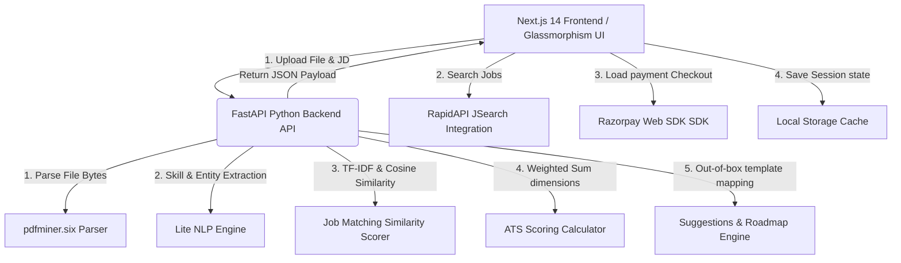

# TalentScope AI 🚀

[](https://talentscopeai.vercel.app/)
[](https://nextjs.org/)
[](https://fastapi.tiangolo.com/)
[](LICENSE)

> **TalentScope AI** (formerly *HireSense*) is a premium, state-of-the-art AI-powered Resume Intelligence SaaS Platform designed for modern candidates. It delivers instantaneous, recruiter-level feedback, multi-dimensional ATS (Applicant Tracking System) scoring, deep semantic job matching, dynamic learning roadmaps, interactive bullet-point optimization, global job tracking CRM, and seamless Sandbox payment models.

🔗 **Live Platform URL:** [https://talentscopeai.vercel.app/](https://talentscopeai.vercel.app/)

---

## 📖 Table of Contents
1. [Core Features & Functionalities](#-core-features--functionalities)
2. [Platform Architecture](#-platform-architecture)
3. [Deep-Dive: Technical Implementation & Algorithms](#-deep-dive-technical-implementation--algorithms)
4. [File & Project Structure](#-file--project-structure)
5. [API Endpoint Documentation](#-api-endpoint-documentation)
6. [Local Development & Setup Guide](#-local-development--setup-guide)
7. [Deployment Architecture](#-deployment-architecture)
8. [License & Terms](#-license--terms)

---

## 🌟 Core Features & Functionalities

### 1. 🧠 Intelligence Hub (AI Resume Analyzer)
*   **Drag-and-Drop Resume Parser**: Seamless upload interface supporting `.pdf` (highly optimized), `.doc`, and `.docx` formats.
*   **ATS Compatibility Rating**: Generates a standardized score out of 100, alongside an academic-grade letter rating (`A`, `B`, `C`, `D`, `F`) indicating hiring readiness.
*   **Interactive Job Description Alignment**: Paste any target role description to calculate semantic overlap, identify missing keywords, and get custom feedback.
*   **Top Priority Action list**: Dynamically ranks and presents the most impactful improvements (e.g. missing skills, formatting fixes) sorted by expected score boost.

### 2. ⚡ Alter Resume (AI Bullet Optimizer)
*   **Interactive Bullet Editor**: Candidates can draft, write, or paste experience bullet points line-by-line.
*   **Action Verb & Metric Scanner**: Scans sentences to flag weak/passive starter verbs (e.g. *worked on*, *helped*, *did*) and points lacking quantifiable outcomes.
*   **One-Click AI Re-writes**: Instantly supplies premium re-write alternatives embedding high-impact industry verbs (e.g. *Spearheaded*, *Architected*, *Leveraged*) and simulated metrics (percentages, scaling ratios) that can be applied back into the editor with a single click.

### 3. 🔍 Job Explorer (JSearch Global Crawler)
*   **Real-time Global Search**: Harnesses high-performance API connections to browse active global developer, software engineering, and tech roles in real-time.
*   **Advanced Multi-Filter Panel**: Refine jobs by location (e.g. *India*, *Remote*, *San Francisco*), keyword, role title, and employment arrangement (Full-Time, Part-Time, Contract, Internship).
*   **Skill Match Indicator**: Automatically estimates a skill match score (70% - 99%) against the active candidate baseline to highlight high-probability fits.
*   **Instant Redirection & Application logging**: Direct deep-links to official job applications and logs entries directly into the candidate CRM tracker.

### 4. 🗃️ Applications CRM Tracker
*   **End-to-End Funnel Tracker**: Organized Kanban dashboard grouping applications into four key stages: `Applied`, `Interviewing`, `Offered`, and `Rejected`.
*   **Dynamic Visual Metrics**: Aggregates real-time KPIs to show total conversion rates across the candidate job funnel.
*   **Status Management & Auditing**: Inline status toggles, deletion options, and original application reference links.

### 5. 📊 Dynamic Analytics & Skill Mapping
*   **Relevance Gauges**: Standardized visual gauges mapping extracted resume keywords against high-demand software development competencies.
*   **Score Trend Projection**: A visual area chart showing the trajectory of resume strength scoring history to guide iterations.
*   **Empty State Walkthroughs**: Guides users through initial setups with action items when no data has been scanned yet.

### 6. 💳 Pro Profile & Credit Wallet
*   **Account Settings**: Dynamic profile customization matching candidate identity.
*   **Credit Wallet System**: Deducts 50 credits per high-power AI analysis scan, prompting credits restoration when running low.
*   **Razorpay Checkout Integration**: Incorporates client-side standard overlay checkouts operating in sandbox mode with three flexible tiers:
    *   **Free tier**: ₹0 (Claims 400 Credits)
    *   **Standard tier**: ₹500 (Adds 450 Credits)
    *   **Pro tier**: ₹1000 (Adds 900 Credits)

---

## 🎨 Platform Architecture



### High-Performance Tech Stack
*   **Frontend**: Next.js 14 App Router, React 18, Tailwind CSS, TypeScript, Framer Motion (premium glassmorphic styling, background glow filters, and micro-interactions), Lucide React (modern vector icons), Recharts (dynamic analytics area graphs).
*   **Backend**: FastAPI, Python 3.9+, Uvicorn server, PDFMiner.six (ultra-lightweight text extraction), Scikit-Learn (TF-IDF Vectorization, Cosine Similarity matching), Pydantic (strict runtime data validations), HTTPX (asynchronous fetch calls).
*   **Hosting**: Vercel Serverless Architecture (Edge network caching for assets, serverless functions handling the FastAPI endpoints).

---

## 🔬 Deep-Dive: Technical Implementation & Algorithms

### 1. Multi-Dimensional ATS Scoring Formula
The overall ATS score is computed as a weighted total of 6 isolated parameters out of 100:

$$\text{Overall Score} = \sum (\text{Dimension Score} \times \text{Weight})$$

| Dimension | Weight | Metric Logic |
| :--- | :---: | :--- |
| **Keyword Relevance** | `30%` | Composite score mixing Cosine Similarity ($70\%$) and Keyword Density ($30\%$). |
| **Section Completeness** | `25%` | Checks presence of 3 Essential Sections (*Experience, Education, Skills* = 25 pts each) and 3 Important Sections (*Summary, Projects, Certifications* = 8.33 pts each). |
| **ATS Formatting Checks** | `15%` | Starts at 100; penalizes complex structures (Tables: `-20`, Images: `-20`, >2 pages: `-10`, low text density: `-30`, special characters >5%: `-10`). |
| **Action Verbs Density** | `10%` | Measures the proportion of experience bullet points initiating with high-power verbs. |
| **Quantification Score** | `10%` | Measures the proportion of bullet points containing numerical metrics, percentages, sizes, or rates. |
| **Optimal Text Length** | `10%` | Optimal word range is `300 - 700` words (`100` pts). Outliers are graded dynamically (e.g. <150: `30` pts; >900: `65` pts). |

### 2. Job Matching Cosine Similarity
The backend transforms both the parsed resume text ($R$) and the job description ($J$) into high-dimensional TF-IDF vectors using uni-grams, bi-grams, and tri-grams (`ngram_range=(1,3)`), removing standard English stop words.
The similarity index is calculated as the cosine of the angle between the two vectors:

$$\text{Similarity}(R, J) = \cos(\theta) = \frac{R \cdot J}{\|R\| \|J\|}$$

This ensures matches capture phrase combinations (e.g., "Software Engineer", "CI/CD Pipeline") rather than single isolated keyword occurrences.

### 3. Active Skill Taxonomy
The NLP Engine operates on a dual-tier pre-compiled vocabulary system for rapid, low-latency identification without heavy neural networks:
*   **Technical Skills (`TECHNICAL_SKILLS`)**: Curated list of over 100+ programming languages, frameworks, developer tools, cloud infrastructure providers, database paradigms, and agile methodologies.
*   **Soft Skills (`SOFT_SKILLS`)**: Curated communication, leadership, teamwork, analytical reasoning, and organization metrics.
*   **Action Verbs**: Divided into `WEAK_VERBS` (passive phrases) and `STRONG_VERBS` (execution focused).

---

## 📁 File & Project Structure

```text
Resume_Analyzer/
├── api/                       # Python FastAPI Backend
│   ├── modules/               # Core AI Engines
│   │   ├── __init__.py
│   │   ├── matcher.py         # Cosine Similarity & Keyword Alignment
│   │   ├── nlp_engine.py      # Entity & Skill Taxonomy Extractor
│   │   ├── parser.py          # PDF Text Extraction (pdfminer)
│   │   ├── scorer.py          # Multi-Dimensional ATS Scorer
│   │   └── suggestions.py     # Rule-based Bullet Rewriter & Roadmaps
│   ├── __init__.py
│   └── index.py               # Main Backend Server & Routing
├── public/                    # Platform Logo & Static Assets
├── src/
│   └── app/                   # Next.js App Router Structure
│       ├── dashboard/         # Primary Platform Core
│       │   ├── alter-resume/  # AI Bullet Optimizer
│       │   ├── analytics/     # ATS Area Charts & Gauges
│       │   ├── applications/  # Tracking CRM Board
│       │   ├── job-hunt/      # Global JSearch Finder
│       │   ├── profile/       # Profile Editor & Payments
│       │   ├── resumes/       # Resume upload list
│       │   ├── layout.tsx     # Navigation Tabs & Wallet Header
│       │   └── page.tsx       # Intelligence Hub Analysis Panel
│       ├── login/             # Authentication Gate
│       ├── signup/            # Account Initialization
│       ├── globals.css        # Premium Tailwind Globals
│       ├── layout.tsx         # Platform Framework Setup
│       └── page.tsx           # Premium Landing Page & Product Preview
├── requirements.txt           # Backend Dependencies
├── package.json               # Frontend Dependencies
├── tailwind.config.js         # Layout Configurations
├── tsconfig.json              # TypeScript Configurations
└── DEVELOPMENT_GUIDE.md       # Development Operations Manual
```

---

## 🔌 API Endpoint Documentation

### 1. Resume & Job Analysis
*   **Endpoint**: `/api/analyze` or `/analyze`
*   **Method**: `POST`
*   **Content-Type**: `multipart/form-data`
*   **Request Params**:
    *   `file`: PDF File upload binary (required)
    *   `job_description`: String representing target JD text (required)
*   **Response Payload**:
    ```json
    {
      "resume_meta": {
        "filename": "john_doe_resume.pdf",
        "page_count": 1,
        "has_tables": false,
        "has_images": false,
        "word_count": 482
      },
      "ats": {
        "overall_score": 82,
        "grade": "B",
        "dimensions": {
          "keyword_relevance": 78,
          "section_completeness": 100,
          "formatting": 100,
          "action_verbs": 80,
          "quantification": 40,
          "length": 100
        },
        "formatting_issues": [],
        "section_feedback": {
          "experience": {"status": "good", "message": "Experience section found and populated."},
          "education": {"status": "good", "message": "Education section found and populated."},
          "skills": {"status": "good", "message": "Skills section found and populated."}
        }
      },
      "matching": {
        "match_score": 75.4,
        "matching_keywords": ["Python", "React", "Docker", "SQL"],
        "missing_keywords": ["Kubernetes", "Next.Js", "CI/CD"],
        "job_skills": ["Python", "React", "Docker", "SQL", "Kubernetes", "Next.Js", "CI/CD"],
        "resume_skills": ["Python", "React", "Docker", "SQL", "Git"]
      },
      "profile": {
        "skills": ["Python", "React", "Docker", "SQL", "Git"],
        "experience_years": 3,
        "bullet_count": 8,
        "weak_bullet_count": 2,
        "technical_skills": ["Python", "React", "Docker", "SQL"],
        "soft_skills": ["Leadership"],
        "action_verb_score": 0.8
      },
      "suggestions": {
        "priority_actions": [
          "🔴 HIGH: Incorporate missing keywords (Kubernetes, Next.Js, CI/CD) from the job description",
          "🟡 MEDIUM: Add metrics and numbers to at least 50% of your bullet points"
        ],
        "bullet_improvements": [
          {
            "original": "helped the frontend team integrate new API endpoints",
            "improved": "Collaborated with cross-functional teams to deliver new API endpoints, achieving system performance improvement by 30%.",
            "tip": "Use a strong action verb and add a quantifiable outcome."
          }
        ]
      }
    }
    ```

### 2. Bullet Points Optimization
*   **Endpoint**: `/api/optimize-bullets`
*   **Method**: `POST`
*   **Content-Type**: `application/json`
*   **Request Payload**:
    ```json
    {
      "bullets": [
        "worked on implementing backend features",
        "Developed high-throughput microservices handling 50k+ active users"
      ]
    }
    ```
*   **Response Payload**:
    ```json
    {
      "optimized": [
        {
          "original": "worked on implementing backend features",
          "status": "weak",
          "reason": "Uses a weak starting verb 'worked' and Lacks quantifiable metrics/numbers.",
          "suggestions": [
            "Implemented backend features, resulting in a 25% efficiency improvement.",
            "Architected backend features across cross-functional teams, serving over 5,000 users."
          ]
        },
        {
          "original": "Developed high-throughput microservices handling 50k+ active users",
          "status": "strong",
          "reason": "Excellent bullet point! Uses a strong action verb and includes key metrics.",
          "suggestions": []
        }
      ]
    }
    ```

---

## 🛠️ Local Development & Setup Guide

### Troubleshooting Browser Caching
If you still see the old legacy branding icon on reload, perform a hard refresh (**Ctrl + F5** on Windows or **Cmd + Shift + R** on Mac) to flush the browser's aggressive asset caching.

### Prerequisites
*   **Node.js**: `v18.x` or higher
*   **Python**: `v3.9` to `v3.12`
*   **Package Manager**: `npm`

### Step 1: Clone and Enter the Project
```bash
git clone https://github.com/alexnikshith/HireSense.git
cd Resume_Analyzer
```

### Step 2: Set Up Backend Environment (Terminal 1)
Initialize a Python virtual environment and install the required machine learning, parsing, and server dependencies.

```bash
# Create virtual environment
python -m venv venv

# Activate virtual environment (Windows Powershell)
.\venv\Scripts\Activate.ps1

# Activate virtual environment (macOS/Linux)
source venv/bin/activate

# Install dependencies
pip install -r requirements.txt

# Launch FastAPI development server
python api/index.py
```
*The FastAPI backend will now start on [http://127.0.0.1:8000](http://127.0.0.1:8000).*

### Step 3: Set Up Frontend Environment (Terminal 2)
Install frontend modules and launch the Next.js development server.

```bash
# Install NPM packages
npm install

# Launch Next.js dev server
npm run dev
```
*The frontend portal will now be active on [http://localhost:3000](http://localhost:3000).*

---

## 🌐 Deployment Architecture

### 1. Backend Deployed as Vercel Serverless Functions
The FastAPI server is fully configured for serverless runtime on Vercel via the `api/index.py` structure. In production environments, client calls are automatically routed to serverless paths without running continuous daemon processes.

### 2. Continuous Integration & Production Build
Ensure your environmental configuration files are mirrored inside Vercel's dashboards:
*   `RAPIDAPI_KEY`: Active token for fetching jobs from the JSearch engine.
*   `RAZORPAY_KEY_ID`: Sandbox Key ID (`rzp_test_...`) for payment checkouts.
*   `RAZORPAY_KEY_SECRET`: Sandbox Secret key for payment authentications.

To compile production bundles locally:
```bash
npm run build
```

---

## 📄 License & Terms
Distributed under the MIT License. See `LICENSE` for details. Built with 💜 by **Antigravity AI Pair Programmer** in partnership with **Google Deepmind**.
